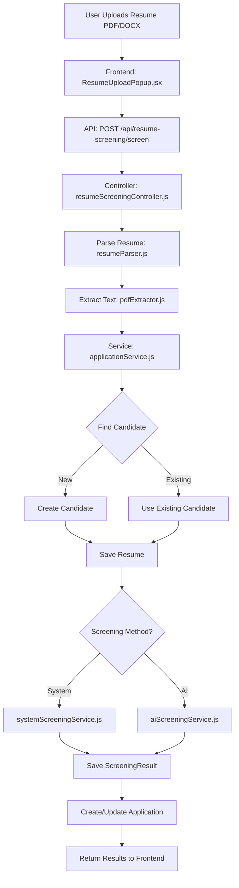

# Resume Upload & Screening - Complete Process Walkthrough

## Overview Flow Diagram



---

## Step-by-Step Process

### 1. File Upload (Frontend)
**File:** `ResumeUploadPopup.jsx`

User selects PDF/DOCX files and clicks "Start Screening".
- Files are sent as `FormData` with `positionId` and `method` (ai_assistant or system).

```javascript
const formData = new FormData();
uploadedFiles.forEach(file => formData.append('resumes', file));
formData.append('positionId', positionId);
formData.append('method', screeningMethod);
```

---

### 2. API Route
**File:** `resumeScreeningRoutes.js`

```
POST /api/resume-screening/screen
```
- Uses Multer middleware for file upload handling
- Max 20 files, 20MB each

---

### 3. Controller Orchestration
**File:** `resumeScreeningController.js`

The controller coordinates the entire flow:

```javascript
exports.screenResume = async (req, res) => {
    // 1. Extract auth (tenantId, userId) from middleware
    // 2. For each uploaded file:
    //    a. Parse resume
    //    b. Find/Create Candidate
    //    c. Save Resume
    //    d. Screen and Create Application
    // 3. Return results array
}
```

---

### 4. Resume Parsing
**Files:** `resumeParser.js`, `pdfExtractor.js`

**Text Extraction:**
- PDF: Uses `pdfjs-dist` library
- DOCX: Uses `mammoth` library

**Data Parsed:**
| Field | Source |
|-------|--------|
| Name | Regex patterns for common name formats |
| Email | Email regex pattern |
| Phone | Phone number regex |
| Skills | Matched against 500+ skills in `skillsConfig.js` |
| Experience | Regex for "X years" patterns |
| Education | Degree keywords (B.Tech, MBA, etc.) |

---

### 5. Candidate Deduplication
**File:** `deduplicationService.js`

**Logic:**
1. Search for existing candidate by **email** (exact match)
2. If not found, search by **phone** (normalized)
3. If found → Return existing candidate
4. If not found → Create new candidate

**Candidate Schema Saved:**
```javascript
{
    name: "Venkatesh",
    email: "venky@example.com",
    phone: "+919876543210",
    source: "Resume Upload",
    status: "New"
}
```

---

### 6. Resume Storage
**File:** `deduplicationService.js` → `saveResume()`

**Resume Schema Saved:**
```javascript
{
    candidateId: ObjectId("..."),      // Links to Candidate
    fileUrl: "memory://buffer",        // File reference
    resume: {
        filename: "Venky_Resume.pdf",
        fileSize: 42745,
        uploadDate: Date
    },
    skills: [
        { skill: "React", experience: "0", expertise: "Beginner" },
        { skill: "JavaScript", experience: "0", expertise: "Beginner" }
    ],
    CurrentExperience: 2,              // Parsed years
    HigherQualification: "B.Tech",
    source: "UPLOAD",
    isActive: true
}
```

---

## 7. Screening Methods

### System Screening (Manual Calculation)
**File:** `systemScreeningService.js`, `resumeScoring.js`

**How it works:**
1. Compares candidate skills against position required skills
2. Uses **exact keyword matching** (case-insensitive)
3. Calculates weighted score based on skill importance

**Scoring Logic:**
```javascript
// Skill Level Weights
REQUIRED: 1.0      // Must have
PREFERRED: 0.7     // Nice to have  
NICE_TO_HAVE: 0.3  // Bonus

// Expertise Multipliers
Expert: 1.0
Advanced: 0.85
Intermediate: 0.7
Beginner: 0.5

// Final Score Formula
finalScore = (matchedPoints / totalPossiblePoints) * 100
```

**Example:**
- Position requires: React (REQUIRED), Angular (PREFERRED)
- Candidate has: React, JavaScript
- React matches → +1.0 points
- Angular missing → 0 points
- Score = 1.0 / 1.7 = ~59%

---

### AI Screening (Claude)
**File:** `aiScreeningService.js`

**How it works:**
1. Sends resume text + position requirements to **Claude API**
2. AI analyzes semantically (understands context, not just keywords)
3. Returns structured JSON with score, strengths, weaknesses

**Prompt Structure:**
```
You are an expert HR recruiter. Analyze this resume against 
the job requirements and provide:
- Overall match score (0-100)
- Key strengths
- Potential concerns
- Skill match assessment
- Recommendation (PROCEED/HOLD/REJECT)
```

**Key Differences from System:**
| Aspect | System | AI |
|--------|--------|-----|
| Matching | Exact keyword | Semantic understanding |
| "React" vs "ReactJS" | No match | Match (understands same) |
| Context | None | Understands job context |
| Speed | Instant | 2-5 seconds |
| Cost | Free | API cost per call |

---

### 8. Screening Result Storage
**File:** `applicationService.js`

**ScreeningResult Schema Saved:**
```javascript
{
    resumeId: ObjectId("..."),
    positionId: ObjectId("..."),
    candidateId: ObjectId("..."),
    tenantId: ObjectId("..."),
    score: 100,                        // 0-100
    skillMatch: 90,                    // Skill match percentage
    recommendation: "PROCEED",         // PROCEED/HOLD/REJECT
    matchedSkills: ["React", "JavaScript", "HTML"],
    missingSkills: [],
    screeningNotes: '{"summary":"Strong candidate...","strengths":["..."],"concerns":["..."]}',
    screenedBy: ObjectId("..."),       // User who initiated
    screenedAt: Date
}
```

---

### 9. Application Creation
**File:** `applicationService.js`

**Application Schema Saved:**
```javascript
{
    applicationNumber: "APP-001",      // Auto-generated
    tenantId: ObjectId("..."),
    positionId: ObjectId("..."),
    candidateId: ObjectId("..."),
    status: "SCREENED",                // APPLIED/SCREENED/INTERVIEWING/OFFERED/HIRED/REJECTED
    screeningScore: 100,
    screeningDecision: "PROCEED",
    appliedAt: Date
}
```

---

### 10. Response to Frontend
**Controller returns:**
```javascript
{
    success: true,
    results: [
        {
            id: "resumeId",
            fileName: "Venky_Resume.pdf",
            matchStatus: "new_candidate",
            matchPercentage: 100,
            skillMatch: 90,
            experienceScore: 0,
            candidateName: "Venkatesh",
            candidateEmail: "venky@example.com",
            screeningResult: {
                summary: "Strong candidate with excellent skill match",
                strengths: ["Meets all 3 required skills"],
                concerns: ["Experience not clearly stated"],
                matchedSkills: ["React", "JavaScript", "HTML"],
                missingSkills: [],
                recommendation: "PROCEED"
            }
        }
    ],
    errors: [],
    message: "Processed 1 resumes successfully. 0 errors."
}
```

---

## Database Schema Summary

| Collection | Purpose |
|------------|---------|
| **Candidate** | Stores candidate personal info (name, email, phone) |
| **Resume** | Stores parsed resume data (skills, experience, file info) |
| **ScreeningResult** | Stores screening analysis (score, matched/missing skills) |
| **Application** | Links Candidate to Position with status tracking |
| **Position** | Job posting with required skills |

---

## File Reference

| File | Purpose |
|------|---------|
| `ResumeUploadPopup.jsx` | Frontend UI for upload |
| `resumeScreeningController.js` | API controller orchestration |
| `applicationService.js` | Core business logic |
| `deduplicationService.js` | Candidate matching & resume saving |
| `resumeParser.js` | Text parsing & skill extraction |
| `pdfExtractor.js` | PDF text extraction |
| `systemScreeningService.js` | Manual skill matching |
| `aiScreeningService.js` | AI-powered analysis |
| `resumeScoring.js` | Score calculation utility |
